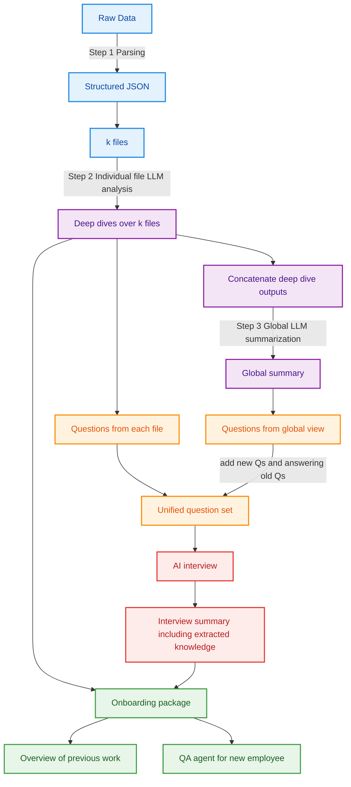

# Implementation Design — Offboarding → Onboarding Agent

## Table of Contents

1. [Architecture Overview](#1-architecture-overview)
2. [Technology Stack](#2-technology-stack)
3. [Data Model & Persistence](#3-data-model--persistence)
4. [Offboarding Graph — Detailed Design](#4-offboarding-graph--detailed-design)
5. [Onboarding Graph — Detailed Design](#5-onboarding-graph--detailed-design)
6. [API Layer](#6-api-layer)
7. [Frontend Integration](#7-frontend-integration)
8. [MVP Scope & Constraints](#8-mvp-scope--constraints)
9. [File Structure](#9-file-structure)

---

## 1) Architecture Overview

The system has **two runtime phases** that are temporally decoupled:

```
┌──────────────────────────────────────────────────────────┐
│                   OFFBOARDING PHASE                      │
│  (employee leaves → files + interview → knowledge store) │
└──────────────┬───────────────────────────────────────────┘
               │  writes to
               ▼
┌──────────────────────────────────────────────────────────┐
│                 SHARED KNOWLEDGE STORE                    │
│  (parsed files, reports, questions, facts, embeddings)   │
└──────────────┬───────────────────────────────────────────┘
               │  reads from
               ▼
┌──────────────────────────────────────────────────────────┐
│                   ONBOARDING PHASE                        │
│  (new hire arrives → narrative + QA agent)                │
└──────────────────────────────────────────────────────────┘
```

Each phase is a **LangGraph StateGraph** running inside a **FastAPI** backend. The Next.js frontend drives the UX, calling the backend via REST + SSE (server-sent events) for streaming progress.

### visual representation


---

## 2) Technology Stack

| Layer | Technology | Purpose |
|-------|-----------|---------|
| Orchestration | LangGraph (Python) | State machines for both graphs |
| Backend API | FastAPI | REST endpoints, SSE streaming |
| LLM | OpenAI | All reasoning, summarization, question generation |
| File parsing | openpyxl, python-pptx, nbformat, sqlglot, pymupdf4llm, python-docx | Normalize files → structured JSON |
| Embeddings | OpenAI `text-embedding-3-small` | Vector index for hybrid retrieval |
| Vector store | ChromaDB (local, zero-config) | Embeddings storage + similarity search |
| Key-value store | Local JSON files (MVP) | Parsed files, reports, question backlog |
| Frontend | Next.js 14 + React + Tailwind | UI for interview, onboarding, QA |
| Package mgmt | uv (Python), npm (Node) | Dependency management |

---

## 3) Data Model & Persistence

### 3.1 ID Scheme

Every artifact belongs to a session:

```
{project_id}/{session_id}/{artifact_type}/{artifact_id}
```

For MVP, `project_id` and `session_id` are passed when the offboarding starts. All artifacts are stored under `data/sessions/{session_id}/`.

### 3.2 Core Data Structures

#### StructuredFile

```python
@dataclass
class StructuredFile:
    file_id: str              # unique hash or slug
    file_name: str            # original filename
    file_type: str            # xlsx | pptx | py | ipynb | md | sql | pdf
    parsed_content: dict      # type-specific parsed output
    metadata: dict            # size, sheets, dates, etc.
    raw_path: str             # path to original file
```

#### DeepDiveReport

```python
@dataclass
class DeepDiveReport:
    file_id: str
    pass_number: int              # 1, 2, or 3
    file_purpose_summary: str
    key_mechanics: list[str]
    fragile_points: list[str]
    at_risk_knowledge: list[str]
    questions: list[Question]
    cumulative_summary: str       # running summary across passes
```

#### Question

```python
@dataclass
class Question:
    question_id: str
    question_text: str
    origin: str                   # "per_file" | "global"
    source_file_id: str | None    # which file generated it
    evidence: list[Evidence]
    priority: str                 # "P0" | "P1" | "P2"
    status: str                   # "open" | "answered_by_files"
                                  # | "answered_by_interview"
                                  # | "merged" | "deprioritized"
    answer: str | None
    confidence: float | None      # 0.0 to 1.0

@dataclass
class Evidence:
    file_id: str
    location: str                 # sheet name, slide number, line range
    snippet: str                  # relevant text excerpt
```

#### InterviewTurn

```python
@dataclass
class InterviewTurn:
    turn_id: int
    question_id: str
    question_text: str
    user_response: str
    extracted_facts: list[str]
    follow_up: str | None
```

#### OnboardingPackage

```python
@dataclass
class OnboardingPackage:
    abstract: str
    introduction: str
    details: str                  # file-by-file guide
    faq: list[dict]               # [{"q": ..., "a": ...}]
    risks_and_gotchas: list[str]
    knowledge_entries: list[dict]
```

### 3.3 Storage Layout (MVP — local filesystem)

```
data/sessions/{session_id}/
├── metadata.json                 # project name, role, timeline, status
├── raw_files/                    # uploaded originals
│   ├── model.xlsx
│   └── deck.pptx
├── parsed/                       # Step 1 output
│   ├── {file_id}.json            # StructuredFile as JSON
│   └── ...
├── deep_dives/                   # Step 2 output
│   ├── {file_id}_pass1.json
│   ├── {file_id}_pass2.json
│   ├── {file_id}_pass3.json
│   └── ...
├── deep_dive_corpus.json         # Concatenated summaries
├── global_summary.json           # Step 3 output
├── question_backlog.json         # Unified question set
├── interview/
│   ├── transcript.json           # Full transcript
│   └── extracted_facts.json      # All facts extracted
├── onboarding_package/
│   ├── package.json              # OnboardingPackage
│   └── onboarding_docs.md        # Human-readable doc
└── vector_index/                 # ChromaDB collection data
```

---

## 4) Offboarding Graph — Detailed Design

The offboarding graph is the core pipeline. It processes uploaded files, reasons about them, interviews the departing employee, and produces a knowledge bundle.

### 4.0 Graph State

All nodes share a single LangGraph `TypedDict` state:

```python
class OffboardingState(TypedDict):
    session_id: str
    project_metadata: dict
    structured_files: list[StructuredFile]
    deep_dive_reports: list[DeepDiveReport]
    deep_dive_corpus: str
    global_summary: str
    question_backlog: list[Question]
    interview_transcript: list[InterviewTurn]
    extracted_facts: list[str]
    onboarding_package: OnboardingPackage | None
    status: str                    # "parsing" | "analyzing" | ...
    current_step: str
    errors: list[str]
```

### 4.1 Step 1 — Parse Files

**Node:** `parse_files`

**Input:** Raw uploaded files (k files, typically 3–6 for MVP).

**Logic:**

1. Detect file type by extension.
2. Call the appropriate parser from `backend/parsers/` (already implemented).
3. Build a `StructuredFile` for each input.
4. Save each to `parsed/{file_id}.json`.

**Parser behavior by type:**

| File type | Key extraction targets |
|-----------|----------------------|
| `.xlsx` | Sheet names, tables, formulas as text, named ranges, hidden sheets, dependency hints |
| `.pptx` | Slide titles, bullet text, speaker notes |
| `.py` | AST: functions, classes, comments, imports, key outputs |
| `.ipynb` | Cell types, code cells, markdown cells, outputs |
| `.md` | Sections, headings, links |
| `.sql` | Tables referenced, joins, filters, aggregations |
| `.pdf` | Text extraction via pymupdf4llm |

**Output → state:** `structured_files` list populated.

**Error handling:** If a file fails to parse, log the error, attach a partial `StructuredFile` with `parsed_content: {"error": "..."}`, and continue. Do not block the pipeline.

---

### 4.2 Step 2 — Per-File Deep Dive (Iterative LLM Analysis)

**Node:** `deep_dive_fan_out` → runs a **subgraph** per file.

This is the most important reasoning step. Each file is read **multiple times** (n passes) to reduce the miss rate.

#### Subgraph: `FileDeepDiveSubgraph`

**State:**

```python
class FileDeepDiveState(TypedDict):
    file: StructuredFile
    pass_number: int
    previous_passes: list[DeepDiveReport]
    current_report: DeepDiveReport | None
```

**Pass 1 — Map & Describe**

Prompt strategy:
```
You are analyzing a {file_type} file named "{file_name}".
Here is its structured content:
{parsed_content}

Provide:
1. file_purpose_summary: What is this file? What does it do?
2. key_mechanics: List the core logic, formulas, workflows.
3. fragile_points: What looks brittle, manual, or error-prone?
4. at_risk_knowledge: What decisions or heuristics here would
   be lost if the author left?
5. questions: What would you ask the author to understand this fully?
   (max 5 questions, each with evidence pointer)
```

**Pass 2 — Critique & Gaps**

Prompt strategy:
```
You previously analyzed this file and produced:
{pass_1_report}

Now re-read the file with fresh eyes. Focus on what you MISSED:
- Assumptions embedded in formulas or constants
- Implicit dependencies on external data or other files
- Manual steps that aren't documented
- Edge cases or failure modes

Update your analysis. Add NEW questions only (don't repeat).
```

**Pass 3 — At-Risk Knowledge Extraction** (xlsx only, skip for simpler files)

Prompt strategy:
```
Final pass. Given your previous analyses:
{pass_1_report}
{pass_2_report}

Focus exclusively on tacit knowledge extraction:
- Why specific numbers/thresholds were chosen
- Override rules or manual adjustments
- Political/stakeholder context affecting the model
- "If X happens, do Y" heuristics

Generate final questions ranked by risk of knowledge loss.
```

**Fan-out strategy:**

Use LangGraph's `Send()` API to run subgraphs in parallel across files:

```python
def fan_out_deep_dives(state: OffboardingState):
    return [
        Send("file_deep_dive", {"file": f})
        for f in state["structured_files"]
    ]
```

**Output → state:** `deep_dive_reports` populated (one per pass per file).

**Persistence:** Save each report to `deep_dives/{file_id}_pass{n}.json` after each pass.

---

### 4.3 Concatenate Deep Dives (Reduce)

**Node:** `concatenate_deep_dives`

**Logic:**

1. For each file, take the **final pass** report (the most refined one).
2. Concatenate all `file_purpose_summary` + `key_mechanics` + `fragile_points` + `at_risk_knowledge` into a single `deep_dive_corpus` document.
3. Collect all questions from all files into `question_proposals_from_files`.

**Output → state:**

- `deep_dive_corpus`: merged text (structured as sections per file)
- `question_backlog`: initialized with all per-file questions (status = `"open"`)

**Persistence:** Save `deep_dive_corpus.json`.

---

### 4.4 Step 3 — Global LLM Summarization

**Node:** `global_summarize`

**Input:** `deep_dive_corpus` + all `structured_files` (for cross-referencing).

**Prompt strategy:**

```
You have analyzed {k} project files individually. Here are the
combined findings:

{deep_dive_corpus}

Now reason ACROSS files:
1. Find assumption mismatches (e.g., deck says X, model uses Y).
2. Map workflow dependencies (which file's output feeds another).
3. Identify missing context (why a value was chosen, where manual
   overrides happen).
4. Produce a global_summary covering the project holistically.
5. Generate NEW questions that only emerge from cross-file analysis.
   For each question, note which files are involved.
```

**Output → state:**

- `global_summary`: project-wide narrative
- New questions added to `question_backlog` with `origin = "global"`

**Persistence:** Save `global_summary.json`.

---

### 4.5 Reconcile Question Backlog (Unified Question Set)

**Node:** `reconcile_questions`

This is where per-file questions and global questions are merged, deduped, and some may be auto-resolved.

**Logic (LLM-assisted):**

1. **Deduplicate / Merge:** LLM groups semantically similar questions. Keep the best-phrased version. Mark duplicates as `"merged"`.
2. **Auto-resolve:** For each open question, check if `deep_dive_corpus` or `global_summary` already contains a clear answer. If yes, mark as `"answered_by_files"` and fill in the `answer` field.
3. **Reprioritize:** Rank remaining open questions:
   - P0: Knowledge that will be **completely lost** (no documentation exists)
   - P1: Knowledge that is **partially documented** but ambiguous
   - P2: Nice-to-have clarifications
4. **Cap:** Keep at most 15 open questions (MVP constraint).

**Prompt strategy:**

```
Here is the current question backlog:
{questions_as_json}

Here is the evidence corpus:
{deep_dive_corpus_summary}
{global_summary}

For each question:
- If two questions ask the same thing, merge them (keep the better one).
- If the evidence clearly answers a question, mark it answered and
  provide the answer.
- Assign priority: P0 (total knowledge loss risk), P1 (partial),
  P2 (nice-to-have).
- Keep at most 15 open questions.

Return the updated backlog as JSON.
```

**Output → state:** `question_backlog` updated in place.

**Persistence:** Save `question_backlog.json`.

---

### 4.6 Step 4 — AI Interview (Bounded Loop)

**Node:** `interview_loop`

This is an interactive step. The LLM asks questions to the departing employee via the frontend chat UI. The loop is **bounded** to prevent runaway interviews.

**Termination conditions** (any one stops the loop):

1. No open P0 or P1 questions remain.
2. `rounds >= 10` (hard cap).
3. User explicitly ends the interview.

**Per-round logic:**

```
┌─────────────────────────────────┐
│  Select next question           │
│  (highest priority open Q)      │
├─────────────────────────────────┤
│  Present question to user       │
│  (via frontend chat)            │
├─────────────────────────────────┤
│  Receive user's answer          │
├─────────────────────────────────┤
│  Extract structured facts       │
│  from the answer                │
├─────────────────────────────────┤
│  Update question:               │
│  status → answered_by_interview │
│  answer  ← extracted facts      │
│  confidence ← LLM assessment    │
├─────────────────────────────────┤
│  Optionally generate 1          │
│  follow-up question             │
│  (only if answer is vague)      │
├─────────────────────────────────┤
│  Check termination conditions   │
│  → continue or stop             │
└─────────────────────────────────┘
```

**Question selection prompt:**

```
Given the current backlog (sorted by priority):
{open_questions}

Pick the most important question to ask next. Phrase it
conversationally — short and specific. Do not ask compound questions.
```

**Fact extraction prompt:**

```
The departing employee answered:
"{user_response}"

In the context of question:
"{question_text}"

Extract:
1. Concrete facts (decisions, numbers, rules, heuristics)
2. Confidence level (high/medium/low) — is the answer clear or vague?
3. If vague: generate exactly 1 follow-up question to clarify.
```

**Output → state:**

- `interview_transcript`: list of `InterviewTurn` objects
- `extracted_facts`: all facts across all turns
- `question_backlog`: updated statuses

**Persistence:** Save after every turn to `interview/transcript.json` and `interview/extracted_facts.json`. Update `question_backlog.json`.

**Frontend integration:** This node is **human-in-the-loop**. It uses LangGraph's `interrupt()` to pause execution and wait for user input from the frontend. The frontend sends the user's response via a POST to `/api/interview/respond`, which resumes the graph.

---

### 4.7 Step 5 — Generate Onboarding Package

**Node:** `generate_onboarding_package`

**Input:** All prior artifacts — `deep_dive_corpus`, `global_summary`, `question_backlog` (with answers), `extracted_facts`.

**Sub-steps:**

#### 5a. Build knowledge entries

Prompt:
```
From the following extracted facts and answered questions,
create structured knowledge entries. Each entry should be one of:
- decision_rationale
- manual_override_rule
- workflow_step
- gotcha_or_failure_mode
- stakeholder_constraint

{extracted_facts}
{answered_questions_with_context}
```

#### 5b. Generate onboarding document

Prompt:
```
You are writing an onboarding document for a new team member
who will take over this project. Use the following materials:

- Global summary: {global_summary}
- Per-file summaries: {file_summaries}
- Knowledge entries: {knowledge_entries}
- FAQ from interview: {faq_from_questions}

Write these sections:
1. Abstract (2-3 sentences: what this project does)
2. Introduction (why it exists, business context, key stakeholders)
3. Details (file-by-file guide: what each file does, how to use it)
4. FAQ (top 5-8 questions a new person would ask, with answers)
5. Risks & Gotchas (most error-prone items, manual steps, known issues)

Keep it practical and clear. A new hire should be able to read this
and start working within a day.
```

**Output → state:** `onboarding_package` populated.

**Persistence:** Save `onboarding_package/package.json` and `onboarding_package/onboarding_docs.md`.

---

### 4.8 Step 6 — Build Retrieval Index

**Node:** `build_retrieval_index`

**Logic:**

1. Chunk the following into retrieval-sized segments (~500 tokens each):
   - Onboarding document sections
   - Each knowledge entry
   - Each answered question + its answer
   - Each deep dive report summary
   - Interview transcript (per-turn)
2. Embed each chunk using the embedding model.
3. Store in ChromaDB with metadata: `source_type`, `file_id`, `section`.
4. Also store raw text alongside embeddings for keyword search (ChromaDB supports this natively via `where_document`).

**Output:** ChromaDB collection stored under `vector_index/`.

---

### 4.9 Complete Offboarding Graph Definition

```python
from langgraph.graph import StateGraph, START, END

builder = StateGraph(OffboardingState)

# Add nodes
builder.add_node("parse_files", parse_files)
builder.add_node("file_deep_dive", file_deep_dive_subgraph)
builder.add_node("concatenate_deep_dives", concatenate_deep_dives)
builder.add_node("global_summarize", global_summarize)
builder.add_node("reconcile_questions", reconcile_questions)
builder.add_node("interview_loop", interview_loop)
builder.add_node("generate_onboarding_package", generate_package)
builder.add_node("build_retrieval_index", build_index)

# Add edges
builder.add_edge(START, "parse_files")
builder.add_conditional_edges(
    "parse_files",
    fan_out_deep_dives,        # returns Send() per file
    ["file_deep_dive"],
)
builder.add_edge("file_deep_dive", "concatenate_deep_dives")
builder.add_edge("concatenate_deep_dives", "global_summarize")
builder.add_edge("global_summarize", "reconcile_questions")
builder.add_edge("reconcile_questions", "interview_loop")
builder.add_edge("interview_loop", "generate_onboarding_package")
builder.add_edge("generate_onboarding_package", "build_retrieval_index")
builder.add_edge("build_retrieval_index", END)

offboarding_graph = builder.compile()
```

---

## 5) Onboarding Graph — Detailed Design

The onboarding graph runs when a new hire arrives. It reads from the knowledge store and provides two capabilities.

### 5.1 Graph State

```python
class OnboardingState(TypedDict):
    session_id: str
    onboarding_package: OnboardingPackage
    retrieval_index: str          # ChromaDB collection name
    chat_history: list[dict]      # [{"role": ..., "content": ...}]
    current_mode: str             # "narrative" | "qa"
```

### 5.2 Node: Generate Overview Narrative

**Node:** `generate_narrative`

Takes the `onboarding_package` and produces a guided reading experience:

1. Start with the abstract — one paragraph on what the project is.
2. Walk through the introduction — business context and stakeholders.
3. Present a **first-week checklist** derived from the details section:
   - Which files to open first
   - Key things to verify still work
   - People to talk to
4. Flag the top 3 risks/gotchas to be aware of immediately.

This is a one-shot generation (not a loop).

### 5.3 Node: QA Agent Loop

**Node:** `qa_loop`

This is the interactive Q&A where the new hire asks questions.

**Per-question flow:**

1. **Retrieve:** Hybrid search on the new hire's question.
   - Vector similarity (top 5 chunks).
   - Keyword filter (for exact terms like sheet names, tickers, model names).
   - Re-rank results by relevance.
2. **Answer:** LLM generates an answer grounded in retrieved chunks.
   - Include **citations**: `[Source: onboarding_docs > Details > model.xlsx]`.
   - Include a **confidence score** (high / medium / low).
3. **Gap detection:** If confidence is low (retrieval score below threshold or LLM says "I'm not sure"):
   - Generate a **gap ticket**:
     ```json
     {
       "gap_description": "How the sensitivity range was chosen",
       "likely_sources": ["model.xlsx > Sensitivity tab", "Ask: John (prev owner)"],
       "priority": "P1"
     }
     ```
   - Present the gap ticket to the new hire as: "I don't have a confident answer. Here's what I'd suggest investigating."

**Termination:** The QA loop runs indefinitely (new hire ends it when done). Each turn is independent — no complex loop termination logic needed.

### 5.4 Complete Onboarding Graph Definition

```python
builder = StateGraph(OnboardingState)

builder.add_node("generate_narrative", generate_narrative)
builder.add_node("qa_loop", qa_loop)

builder.add_edge(START, "generate_narrative")
builder.add_edge("generate_narrative", "qa_loop")
# qa_loop uses interrupt() for human-in-the-loop

onboarding_graph = builder.compile()
```

---

## 6) API Layer

### 6.1 FastAPI Backend Endpoints

```
POST   /api/offboarding/start
       Body: { project_name, role, timeline, files: [UploadFile] }
       Returns: { session_id }
       Action: Saves files, kicks off offboarding graph.

GET    /api/offboarding/{session_id}/status
       Returns: { current_step, progress_pct, errors }
       Action: Reads graph state, returns current position.

GET    /api/offboarding/{session_id}/stream
       Returns: SSE stream of progress events.
       Events: { step, message, data }
       Action: Real-time updates as nodes complete.

POST   /api/interview/{session_id}/respond
       Body: { user_response: str }
       Returns: { next_question, facts_extracted, remaining_questions }
       Action: Feeds response into interview_loop, resumes graph.

POST   /api/interview/{session_id}/end
       Returns: { status: "generating_package" }
       Action: Force-terminates interview, moves to package generation.

GET    /api/onboarding/{session_id}/narrative
       Returns: { narrative_md, checklist, top_risks }
       Action: Returns pre-generated onboarding narrative.

POST   /api/onboarding/{session_id}/ask
       Body: { question: str }
       Returns: { answer, citations, confidence, gap_ticket? }
       Action: Runs QA retrieval + generation.

GET    /api/session/{session_id}/artifacts
       Returns: { files, deep_dives, questions, package }
       Action: Returns all generated artifacts for inspection.
```

### 6.2 SSE Event Format

The frontend subscribes to `/api/offboarding/{session_id}/stream` for real-time progress:

```json
{"event": "step_started",  "data": {"step": "parse_files", "message": "Parsing 5 files..."}}
{"event": "step_progress", "data": {"step": "file_deep_dive", "message": "Analyzing model.xlsx (pass 2/3)", "pct": 45}}
{"event": "step_completed","data": {"step": "global_summarize", "message": "Global summary ready"}}
{"event": "interview_ready","data": {"first_question": "...", "total_questions": 12}}
{"event": "complete",      "data": {"message": "Onboarding package generated"}}
```

---

## 7) Frontend Integration

### 7.1 Page Flow

```
/ (Home)
  → Upload files + enter project metadata
  → POST /api/offboarding/start

/screening
  → Subscribe to SSE stream
  → Show progress: parsing → analyzing → summarizing → reconciling
  → Display discovered knowledge gaps and questions in real-time

/interview
  → Chat UI: LLM asks questions, user types answers
  → Each turn: POST /api/interview/{session_id}/respond
  → Sidebar: show question backlog with live status updates
  → "End interview" button → POST /api/interview/{session_id}/end

/handoff
  → Show generated onboarding package preview
  → Allow downloading the onboarding doc as markdown/PDF
  → Transition point: "Package ready for new hire"

/onboarding (new hire view)
  → Display narrative (abstract → intro → details → checklist)
  → QA chat panel: POST /api/onboarding/{session_id}/ask
  → Show citations inline, gap tickets when confidence is low
```

### 7.2 State Management

Use React Context (already set up as `DemoContext` and `ConversationContext`) to track:

- `sessionId`: current offboarding/onboarding session
- `currentStep`: which pipeline stage we're in
- `questions`: live question backlog (updated via SSE)
- `chatHistory`: interview or QA conversation turns

---

## 8) MVP Scope & Constraints

### Hard limits (for TreeHacks demo)

| Dimension | Limit | Reason |
|-----------|-------|--------|
| Files per session | 3–6 | Keeps LLM costs and latency manageable |
| Deep dive passes | 3 for xlsx, 2 for others | Diminishing returns after 3 |
| Questions per file | 3–5 | Prevents question explosion |
| Total open questions | Cap at 15 | Interview must be completable in ~10 min |
| Interview rounds | Cap at 10 | Bounded loop, no infinite interviews |
| Onboarding doc length | 1–2 pages | Concise and actionable |

### Demo scenario

Use the sample artifacts already in `public/artifacts/alice-chen/`:

- `Q3_Loss_Forecast.json` (Excel → pre-parsed)
- `Segment_Analysis.json` (Excel → pre-parsed)
- `loss_model.py` (Python model)
- `threshold_config.py` (Python config)
- `Risk_Committee_Notes.md` (Markdown)
- `Escalation_Policy.md` (Markdown)

Demo flow:
1. Upload the 6 files → pipeline runs (show progress via SSE)
2. Pipeline surfaces ~12 questions (some auto-answered)
3. Interview: answer 5–8 questions in a chat UI
4. Generate onboarding package
5. Switch to "new hire" mode: read narrative, ask 3 QA questions
   - 1 answered confidently with citation
   - 1 answered with partial confidence
   - 1 triggers a gap ticket

---

## 9) File Structure

```
golden_gate/
├── backend/
│   ├── main.py                       # FastAPI app entry point
│   ├── config.py                     # API keys, model config, limits
│   ├── parsers/                      # [EXISTING] file parsers
│   │   ├── __init__.py
│   │   ├── excel_parser.py
│   │   ├── pptx_parser.py
│   │   └── ...
│   ├── graphs/                       # LangGraph definitions
│   │   ├── __init__.py
│   │   ├── offboarding_graph.py      # Main offboarding StateGraph
│   │   ├── onboarding_graph.py       # Onboarding StateGraph
│   │   └── subgraphs/
│   │       └── file_deep_dive.py     # Per-file iterative analysis
│   ├── nodes/                        # Node implementations
│   │   ├── __init__.py
│   │   ├── parse_files.py
│   │   ├── deep_dive.py
│   │   ├── concatenate.py
│   │   ├── global_summarize.py
│   │   ├── reconcile_questions.py
│   │   ├── interview.py
│   │   ├── generate_package.py
│   │   └── build_index.py
│   ├── models/                       # Data classes
│   │   ├── __init__.py
│   │   ├── state.py                  # OffboardingState, OnboardingState
│   │   ├── artifacts.py              # StructuredFile, DeepDiveReport, etc.
│   │   └── questions.py              # Question, Evidence
│   ├── services/                     # Shared services
│   │   ├── llm.py                    # Claude API wrapper
│   │   ├── embeddings.py             # Embedding + ChromaDB ops
│   │   └── storage.py                # File I/O helpers
│   ├── routes/                       # FastAPI routers
│   │   ├── offboarding.py
│   │   ├── interview.py
│   │   ├── onboarding.py
│   │   └── session.py
│   └── tests/
│       ├── test_parsers.py           # [EXISTING]
│       ├── test_nodes.py
│       └── test_graphs.py
├── src/                              # [EXISTING] Next.js frontend
│   ├── app/
│   │   ├── api/                      # Next.js API routes (proxy to FastAPI)
│   │   ├── screening/
│   │   ├── manager-interview/
│   │   ├── conversation/
│   │   ├── handoff/
│   │   └── onboarding/               # NEW: onboarding view for new hire
│   ├── components/
│   ├── context/
│   ├── lib/
│   └── types/
├── data/
│   └── sessions/                     # Runtime session data
├── docs/
│   ├── general_design.md
│   └── implementation_design.md      # This document
├── public/artifacts/                  # Sample demo files
├── pyproject.toml                     # Python deps (uv)
├── package.json                       # Node deps
└── README.md
```

---

## Appendix: LLM Call Summary

| Step | LLM calls | Parallelizable | Estimated tokens (in+out) |
|------|-----------|---------------|--------------------------|
| Parse files | 0 | N/A | 0 (pure code) |
| Deep dive (per file, 3 passes) | 3 × k | Yes (across files) | ~4k in + 2k out per pass |
| Concatenate | 0 | N/A | 0 (pure code) |
| Global summarize | 1 | No | ~8k in + 3k out |
| Reconcile questions | 1 | No | ~4k in + 2k out |
| Interview (per turn) | 2 (select Q + extract facts) | No | ~2k in + 1k out per turn |
| Generate package | 2 (entries + doc) | Partially | ~6k in + 4k out |
| Build index | 0 (embedding calls only) | Yes (batch embed) | N/A |

**Estimated total for 6 files, 8 interview rounds:** ~120k input tokens, ~50k output tokens.
